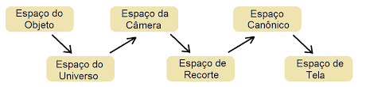
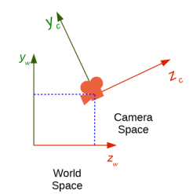
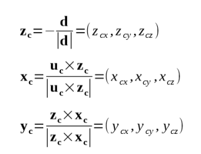
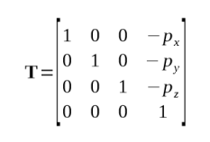

# Trabalho 2 - Pipeline Gráfico

Esse trabalho é a continuação do trabalho anterior, no qual fizemos a rasterização de pontos e linhas. Agora, vamos implementar o pipeline gráfico, que consiste em uma sequência de transformações, ou seja, uma sequência de passos de modelos matemáticos até chegar a rasterização, aplicando rotações, escala e translação.

	 
	
	 

## Partes do Pipeline Gráfico

## Espaço do Objeto
Modelos tridimensionais que são definidos no seu próprio sistema de coordenadas. É interessante posicionar seu objeto no centro (origem) para facilitar os cálculos nas transformações.

O que isso quer dizer? Quer dizer que é nesse espaço que efetuamos as transformações de:Escala, Rotação, Translação, Shear.
Essas transformações são realizadas através da manipulação de matrizes e isso é facilitado com o objeto na origem.

Temos aqui a matriz model, na qual leva o objeto do espaço do objeto para o espaço do universo.

## Espaço do Universo: 
Espaço que reúne todos os objetos em um espaço só. É através desse espaço que podemos visualizar o objeto na tela.

## Espaço da Câmera:
Expõe os vértices com a câmera na origem. A nossa câmera possui:

 Posição (px, py, pz)
 Direção (dx, dy, dz)
 Vetor up (ux, uy, uz)

Obs.: Nesse espaço há a simplificação das projeções 3D para 2D, pois usamos coordenadas homogêneas (esse conceito será visto mais a frente).

Para a construção do sistema de coordenadas da câmera usamos a regra da mão direita, onde o X está apontando para dentro na imagem a seguir:

 

	 
	
	 

						Coordenadas da Câmera
 
Diante disso, vamos calcular :

   Para calcular o Zc iniciamos subtraindo a posição da câmera com a câmera lookat e  dividimos pela norma.
   Para calcular o Xc pegamos vetor Up e fazemos o produto vetorial com o Zc, dividindo pela sua norma.
   Para calcular o Yc fazemos o produto vetorial de Zc e Xc e dividimos pela norma.

Logo abaixo temos respectivamente essas operações:

	 
	
	 

						Transformação View

Sendo assim, temos a Matriz View, na qual leva do espaço do universo para o espaço da câmera. Ela se encarrega da posição e da direção para onde a câmera aponta

Para a construção dessa matriz usamos as coordenadas encontradas anteriormente:

(Xcx, Xcy, Xcz)

(Ycx, Ycy, Ycz)

(Zcx, Zcy, Zcz)

Então, B=

     |   Xcx    Ycx    Zcx   |

     |   Xcy    Ycy     Zcy  |

     |   Xcz    Ycz     Zcz  |
    

	 
	
	 

					Transformação da Matriz View(1)

	 
	
	 

					Transformação da Matriz View(2)

	 
	
	 

						Operação Mview
    
## Espaço de Recorte: 

O espaço de recorte está entre o espaço da câmera e o espaço canônico.

Sendo assim, temos que após as transformações das nossas primitivas posicionamos nossa câmera e tudo que estiver ao alcance dela é renderizado e o que estiver fora de seu plano é recortado, ou seja, será removido. Isso influencia diretamente no processamento gráfico.

## Espaço Cânonico:

É nesse espaço que asseguramos o que vai exibir na tela, pois é aqui onde ocorre o mapeamento dos vértices para centralizar o volume obtido no espaço da câmera para o espaço canônico.

## Espaço da Tela:
Nesse espaço trabalharemos com as coordenadas do espaço canônico e é onde nosso objeto irá ser rasterizado.

## Desenvolvimento

Com as transformações, que podemos aplicar ao nosso objeto devidamente explicadas iremos usá-las.

### Transformação: Espaço do Objeto → Espaço do Universo
Vamos sair do espaço do objeto para o espaço do universo (matriz model), isto é, reunir o que temos de objetos em um só espaço para poder visualizar na tela, aplicando as transformações: rotação, translação e escala.

	 
	
	 

### Transformação: Espaço do Universo → Espaço da Câmera
A matriz view transforma os vértices do espaço do Universo para o espaço da câmera, composto de uma matrix de translação(T) e uma mudança de base(Bt) sendo aplicado nos 3 pontos da camera(posicao ,look-at , up).

	 
	
	 

### Transformação: Espaço da Câmera → Espaço Projetivo ou de Recorte
Isto é feito através da multiplicação dos vértices pelo matriz projection. Adiciona uma perspectiva que faz com que o que está mais distante da câmera está menor e o que está mais perto, está maior.

	 
	
	 

### Transformação: Espaço de Recorte → Espaço “Canônico” 
É onde ocorrerá o recorte da cena. Como a coordenada homogênea nesse espaço pode ser diferente de 0, iremos simplesmente dividir todas as coordenadas (inclusive a coordenada homogênea) por a coordenada homogênea, isso encarregará de por em perspectiva a cena.

	 
	
	 

### Transformação: Espaço Canônico → Espaço de Tela
Isto é feito através da multiplicação dos vértices por uma matriz chamada ViewPort, que contém escalas e translações.

	 
	
	
	 

### Rasterização
No fim aplicamos a rasterização no vertices já implementada no primeiro trabalho

## Resultado

Logo abaixo temos o resultado final com a comparação do projeto com o disponível pelo professor Christian Pagot.

Do lado esquerdo está o do professor e do lado direito o desenvolvido.

	 
	
	
	 

### Outros Objetos:

	 
	
	<h5 align="center">Cone</h5>

	 
	
	<h5 align="center">Cubo</h5>

## Dificuldades

Utilizaçao da biblioteca glm para operação de matrizes e vetores.

## Referências

	- Notas de Aula e exemplo de algoritmo em Octave feito em sala do Professor Christian A. P.
	- https://glm.g-truc.net/0.9.4/api/a00131.html

