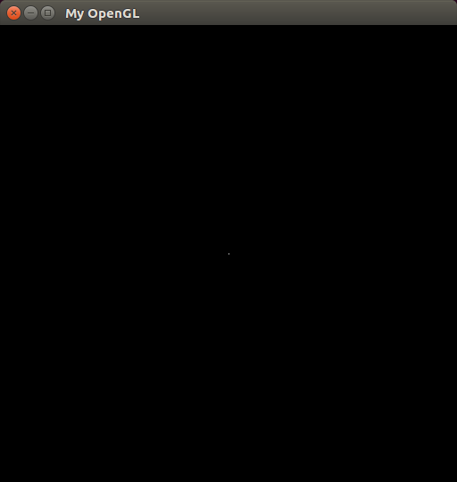
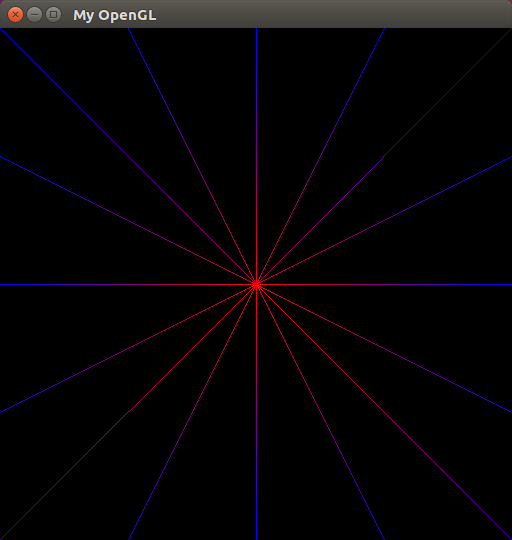
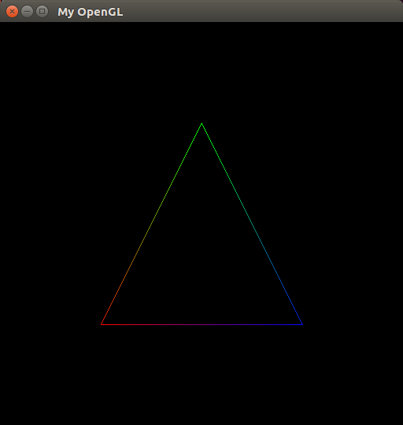
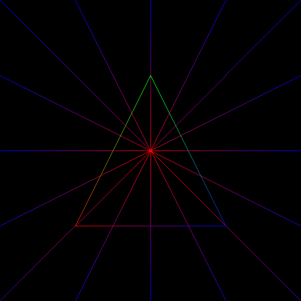

# Rasteirização 
Implementação dos algoritmos para rasteirização de pontos e linhas

O trabalho proposto tem como objetivo desenvolver três funções:

1. PutPixel: Rasterizar um ponto na memória de vídeo, recebendo os parâmetros da posição do pixel (x,y) e sua cor (RGBA);
2. DrawLine: Rasterizar uma linha na tela usando o algoritmo de  Bresenham, recebendo como parâmetros os seus vértices e as cores de cada vértice e ao longo da linha rasterizada as cores dos pixels devem se interpolar;
3. DrawTriangle: Função que desenha um triângulo na tela, recebendo como parâmetros as posições dos três vértices e as cores (RGBA) de cada um dos vértices.

## Rasterizando um ponto (Put Pixel)

   Os parâmetros de posição “x,y” variam, o x aumenta da esquerda para a direita e o y de cima para baixo. Esses parâmetros começam do zero e vão até o fim da janela menos um. Por exemplo, se for até a n-ésima posição, dizemos que será até n-1.
  O RGBA representa o padrão de cores em inglês, em que são: vermelho (red), verde (green), azul (blue) e alpha (transparência). O valor do “r,g,b,a” varia de 0 a 255. Foi criado uma classe chamada xyRGBA para adquirir esses atributos.
  Para implementação dessa função criamos uma classe com a posição “x,y” e a cor “RGBA”. 
  Para saber em que posição de memória deverá ser gravado o pixel, temos que entender o cálculo do offset, a explicação por trás desse cálculo é o seguinte, um píxel possui 4 bytes e em cada byte desses define-se uma cor.
  O ponto a seguir esta na posição (256,256) e RGBA(255,255,255,255)
  

	 
	
	 

## Rasterizando uma linha (Draw Line)

  A rasterirização da linha é feita através do algoritmo de Bresenham (algoritmo do ponto médio) no qual se tem que os píxels que possui a reta devem ser contínuo, porém esse algoritmo é apenas para um octante (se calculam os pontos de 0º a 45º) e temos que modificá-lo para os outros octantes.
  A função DrawLine() propõe a união de dois pontos por uma reta, calculando sempre entre os próximos pixels E e NE , para isso foi reutilizado também a função putPixel repetidamente. Foi pedido para se esses pontos tiverem cores diferentes teremos que interpolar essas cores.
  Para teste colocamos um pixel Central(256,256), e o restante pontos que abrangem todos os octantes, do centro a borda.
 

	 
	
	 

## Rasterizando um triângulo (Draw Triangle)

   Com a função DrawLine implementada e a interpolação também, então foi só chamar três vezes essa mesma função com o ponto 1 ligando com o ponto 2, o ponto 2 ligando com o ponto 3 e o ponto 3 ligando com o ponto 1, para implementar a função DrawTriangle.

	 
	
	 

	 
	
	 

## Equipe

- Edimar Bezerra da Silva Neto 
- Natalia Caroline Guedes Barreto

## Referências

https://icglima20152.wordpress.com/
https://github.com/ThiagoLuizNunes/CG-Assignments
PAGOT, Christian Azambuja. Rasterization: Lecture 2.
